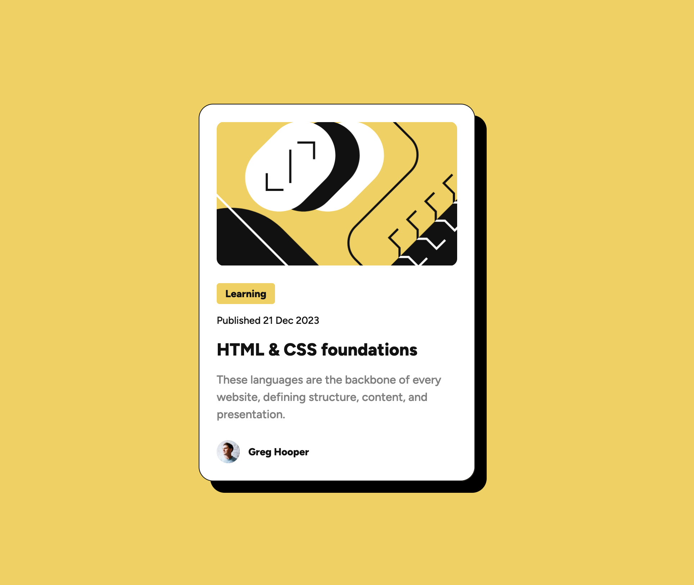

## Table of Contents

1. [Blog Preview Card](#blog-preview-card)
2. [FAQ Accordion](#faq-accordion)

---------------------------------------------------------------------------------

## Blog Preview Card 

- 👾 [Github](https://github.com/UnionPAC/blog-preview-card)
- 🔗 [Demo](https://unionpac.github.io/blog-preview-card/)

#### Project Description
A blog preview card component built using only HTML & CSS.

### Screenshots

---------------------------------------------------------------------------------
## Project 2: FAQ Accordion 

- 👾 [Github](https://github.com/UnionPAC/faq-accordion)
- 🔗 [Demo](https://faq-accordion-chi-fawn.vercel.app/)

#### Project Description
A FAQ Accordion component built using HTML, CSS and JavaScript. 
Includes keyboard accessibility funtionality for navigating the accordion using only the keyboard.

### Screenshots

